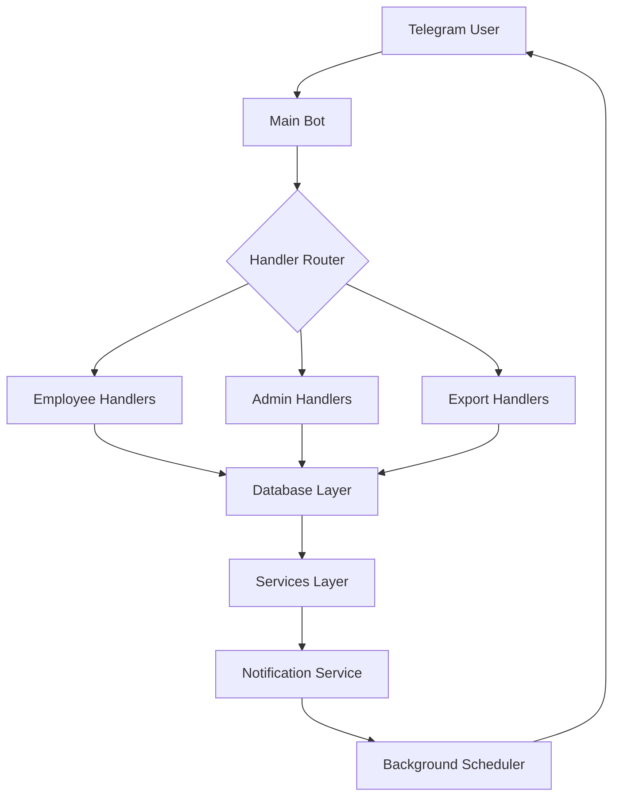

# 🏗️ **Architecture Documentation**

## 📁 **Project Structure**

```
Visioneering-ETCE/
├── 📱 **Main Application**
│   ├── main_bot.py              # New modular main bot file
│   ├── bot.py                   # Original monolithic bot (legacy)
│   └── database.py              # Database operations
│
├── ⚙️ **Configuration**
│   ├── config/
│   │   ├── __init__.py
│   │   └── settings.py          # Centralized configuration
│   └── .env                     # Environment variables
│
├── 🎛️ **Handlers** (Modular Commands)
│   ├── handlers/
│   │   ├── __init__.py
│   │   ├── employee_handlers.py # Employee-specific commands
│   │   ├── admin_handlers.py    # Admin-specific commands
│   │   └── export_handlers.py   # Data export functionality
│
├── 🔧 **Services** (Business Logic)
│   ├── services/
│   │   ├── __init__.py
│   │   └── callback_service.py  # Inline keyboard callbacks
│   ├── notification_service.py  # Reminder & alert system
│   └── location_utils.py        # GPS utilities
│
├── 📄 **Documentation**
│   ├── README.md               # Main documentation
│   ├── FEATURES_GUIDE.md       # Features & usage guide
│   ├── ARCHITECTURE.md         # This file
│   └── DEPLOYMENT.md          # Deployment instructions
│
└── 🚀 **Deployment**
    ├── requirements.txt        # Python dependencies
    ├── setup_admin.py         # Admin setup script
    ├── Procfile              # Heroku deployment
    ├── render.yaml           # Render deployment
    └── runtime.txt           # Python version
```

---

## 🧩 **Modular Components**

### **1. Configuration Layer** (`config/`)

```python
# config/settings.py
- Centralized configuration management
- Environment variable loading
- Settings validation
- Default values and constants
```

**Benefits:**
- ✅ Single source of truth for settings
- ✅ Easy to modify without touching code
- ✅ Validation prevents runtime errors
- ✅ Environment-specific configurations

### **2. Handler Layer** (`handlers/`)

#### **Employee Handlers** (`employee_handlers.py`)
```python
class EmployeeHandlers:
    - /start, /register commands
    - Location-based check-in/out
    - Personal reports and status
    - Reminder management
```

#### **Admin Handlers** (`admin_handlers.py`)
```python
class AdminHandlers:
    - /admin panel
    - User promotion (/add_admin)
    - System-wide reports
    - Alert configuration
```

#### **Export Handlers** (`export_handlers.py`)
```python
class ExportHandlers:
    - CSV data exports
    - Daily/monthly reports
    - Employee lists
    - Detailed attendance data
```

**Benefits:**
- ✅ **Separation of Concerns**: Each handler focuses on specific functionality
- ✅ **Easier Testing**: Individual components can be tested in isolation
- ✅ **Code Reusability**: Handlers can be reused across different contexts
- ✅ **Maintainability**: Changes to one area don't affect others

### **3. Service Layer** (`services/`)

#### **Callback Service** (`callback_service.py`)
```python
class CallbackService:
    - Inline keyboard interactions
    - Button callback handling
    - State management
```

#### **Notification Service** (`notification_service.py`)
```python
class NotificationService:
    - Automated reminders
    - Admin alerts
    - Background scheduler
    - Message delivery
```

**Benefits:**
- ✅ **Business Logic Separation**: Core logic separated from presentation
- ✅ **Async Operations**: Non-blocking background services
- ✅ **Scalability**: Services can be distributed or scaled independently

### **4. Data Layer** (`database.py`)

```python
class AttendanceDatabase:
    - SQLite operations
    - Employee management
    - Attendance tracking
    - Export queries
    - Notification logging
```

**Benefits:**
- ✅ **Data Abstraction**: Database operations isolated from business logic
- ✅ **Query Optimization**: Centralized database access
- ✅ **Transaction Management**: Proper database transaction handling

---

## 🔄 **Data Flow Architecture**



### **Request Flow:**
1. **User Input** → Telegram message/callback
2. **Bot Router** → Determines appropriate handler
3. **Handler Processing** → Business logic execution
4. **Database Operations** → Data persistence
5. **Service Layer** → Background processing
6. **Response** → User feedback

---

## 🎯 **Design Patterns Used**

### **1. Command Pattern**
- Each command handler encapsulates specific actions
- Easy to add new commands without modifying existing code

### **2. Dependency Injection**
- Handlers receive database instance in constructor
- Loose coupling between components

### **3. Single Responsibility Principle**
- Each class/module has one reason to change
- Clear separation of concerns

### **4. Factory Pattern**
- Main bot class orchestrates component creation
- Centralized initialization

---

## 🔧 **Component Dependencies**

```
main_bot.py
├── config.settings
├── database.AttendanceDatabase
├── notification_service.NotificationService
├── handlers.employee_handlers.EmployeeHandlers
├── handlers.admin_handlers.AdminHandlers
├── handlers.export_handlers.ExportHandlers
└── services.callback_service.CallbackService
```

### **Dependency Graph:**
- **Main Bot** → All Components
- **Handlers** → Database
- **Services** → Database
- **Notification Service** → Database + Telegram Bot API
- **All Components** → Configuration

---

## 🚀 **Benefits of Modular Architecture**

### **Development Benefits:**
- ✅ **Easier Onboarding**: New developers can focus on specific modules
- ✅ **Parallel Development**: Multiple developers can work on different modules
- ✅ **Code Reviews**: Smaller, focused changes are easier to review
- ✅ **Testing**: Unit tests can target specific components

### **Maintenance Benefits:**
- ✅ **Bug Isolation**: Issues are contained within specific modules
- ✅ **Feature Addition**: New features can be added without affecting existing code
- ✅ **Code Refactoring**: Individual modules can be refactored independently
- ✅ **Performance Optimization**: Bottlenecks can be identified and optimized per module

### **Deployment Benefits:**
- ✅ **Selective Updates**: Only changed modules need to be updated
- ✅ **Error Recovery**: Module failures don't crash the entire system
- ✅ **Monitoring**: Each component can be monitored independently
- ✅ **Scaling**: Individual services can be scaled based on load

---

## 🔄 **Migration from Monolithic to Modular**

### **Current State** (`bot.py`):
```python
# Single large file with all functionality
class AttendanceBot:
    # 600+ lines of mixed responsibilities
    - Command handlers
    - Export functions
    - Admin functions
    - Callback handling
    - Configuration
```

### **New Modular State** (`main_bot.py` + modules):
```python
# Clean orchestration layer
class AttendanceBot:
    # 150 lines focused on coordination
    - Component initialization
    - Handler registration
    - Service coordination
```

### **Migration Benefits:**
- ✅ **Reduced Complexity**: Main file is now 150 lines vs 600+
- ✅ **Better Organization**: Related functionality is grouped together
- ✅ **Improved Testability**: Each component can be tested in isolation
- ✅ **Enhanced Readability**: Code is easier to understand and navigate

---

## 🛠️ **Running the Modular Version**

### **Option 1: New Modular Bot**
```bash
python main_bot.py
```

### **Option 2: Legacy Monolithic Bot**
```bash
python bot.py
```

Both versions are functionally identical but organized differently.

---

## 📈 **Future Enhancements**

The modular architecture enables easy addition of:

1. **New Handler Modules**: Team management, shift scheduling, etc.
2. **Additional Services**: Analytics, integrations, webhooks
3. **Plugin System**: Third-party extensions
4. **Microservices**: Break services into separate deployments
5. **API Layer**: REST/GraphQL API for external integrations

---

**Made with ❤️ for El Mansoura Team** 